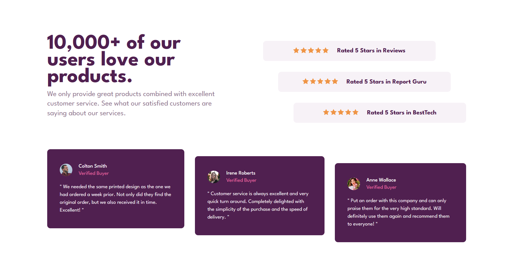

# Frontend Mentor - Social proof section solution

This is a solution to the [Social proof section challenge on Frontend Mentor](https://www.frontendmentor.io/challenges/social-proof-section-6e0qTv_bA). Frontend Mentor challenges help you improve your coding skills by building realistic projects. 

## Table of contents

- [Overview](#overview)
  - [The challenge](#the-challenge)
  - [Screenshot](#screenshot)
  - [Links](#links)
- [My process](#my-process)
  - [Built with](#built-with)
  - [What I learned](#what-i-learned)
- [Author](#author)

## Overview

### The challenge

Users should be able to:

- View the optimal layout for the section depending on their device's screen size

### Screenshot

### Links

- Solution URL: [Solution URL](https://www.frontendmentor.io/solutions/responsive-social-proof-section-using-css-grid-and-flexbox-H1ww-29H5)
- Live Site URL: [Live Site URL](https://rivercodes.github.io/social-proof-section/)

## My process
-I first created the layout in a [Codepen](https://codepen.io/rivercodes/pen/LYQPmjK) using colored div's. This gave me the opportunity to test out both Grid and Flexbox and create a wireframe model of the component.
-I then started with the mobile design, as it was simpler and styled the individual components. I used Grid Areas for the main sections of the main component. I used nested flexbox for the styling of the individual components.
-I then proceeded with the desktop design. It was not too hard, and I feel like my understanding of flexbox and grid has increased
### Built with

- Semantic HTML5 markup
- CSS custom properties
- Flexbox
- CSS Grid
- Mobile-first workflow

### What I learned

I learnt a lot about grid and flexbox in this challenge. I can now visualize how I want to use both to create complex layouts. I am proud of the grid areas that I used that allowed me to switch between mobile and desktop views fairly easily.

## Author

- Frontend Mentor - [@yourusername](https://www.frontendmentor.io/profile/yourusername)